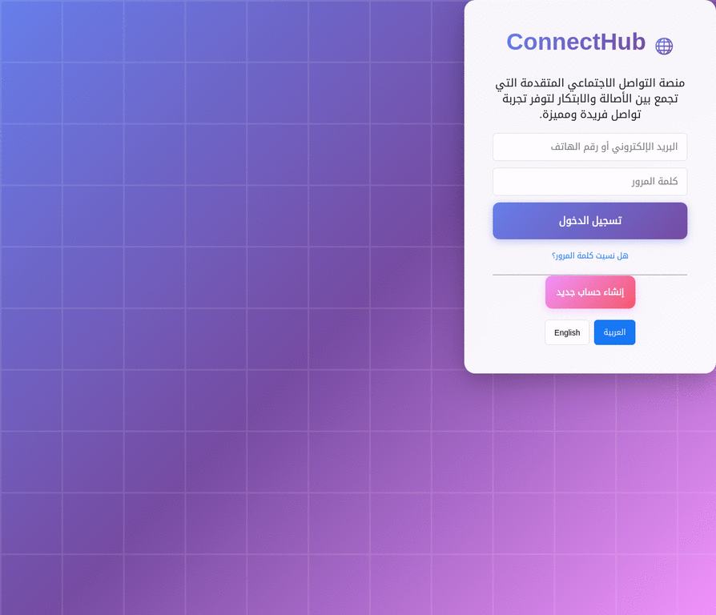

# ConnectHub - منصة التواصل الاجتماعي المتقدمة



## نظرة عامة على المشروع

ConnectHub هي منصة تواصل اجتماعي متقدمة تجمع بين الأصالة والابتكار لتقديم تجربة تواصل فريدة ومميزة. تم تصميم المنصة لتكون سهلة الاستخدام، مع التركيز على الميزات التفاعلية والأمان.

## الميزات الرئيسية

*   **نظام تسجيل دخول وتسجيل حسابات متكامل**: يتيح للمستخدمين إنشاء حسابات جديدة وتسجيل الدخول بأمان.
*   **دعم متعدد اللغات**: يدعم اللغة العربية والإنجليزية مع إمكانية التبديل بينهما بسلاسة.
*   **نظام منشورات تفاعلي**: يمكن للمستخدمين إنشاء منشورات نصية، وإضافة تعليقات، وإبداء الإعجاب.
*   **فلترة المحتوى غير اللائق**: نظام متطور يعتمد على الذكاء الاصطناعي لفلترة الكلمات والأنماط غير اللائقة في المنشورات والتعليقات.
*   **نظام أصدقاء متقدم**: إدارة طلبات الصداقة، وقوائم الأصدقاء، واقتراحات الأصدقاء.
*   **إشعارات فورية**: لتنبيه المستخدمين بالأنشطة الجديدة.
*   **تعليقات صوتية (قريباً)**: ميزة مبتكرة لإضافة تعليقات صوتية على المنشورات.
*   **تصميم متجاوب**: يتكيف مع مختلف أحجام الشاشات والأجهزة.

## الأخطاء التي تم إصلاحها

تم تحديد وإصلاح خطأ في ملف `script.js` يتعلق بتكرار تعريف المتغير `mediaRecorder`. هذا الإصلاح يضمن عمل وظائف التسجيل الصوتي بشكل صحيح ويمنع الأخطاء المحتملة في وقت التشغيل.

كما تم تحديث مسارات المستودع في ملف `package.json` لتعكس المستودع الحالي بشكل صحيح.

## كيفية التشغيل محلياً

لإعداد وتشغيل المشروع على جهازك المحلي، اتبع الخطوات التالية:

1.  **استنساخ المستودع (Clone the repository)**:
    ```bash
    git clone https://github.com/AbdulElahOthmanGwaith/my-website-project.git
    cd my-website-project
    ```

2.  **تثبيت التبعيات (Install dependencies)**:
    يتطلب المشروع `http-server` و `gh-pages` للتشغيل والنشر. يمكنك تثبيتهما باستخدام `npm`:
    ```bash
    npm install
    ```

3.  **تشغيل الخادم المحلي (Run the local server)**:
    يمكنك تشغيل المشروع باستخدام الأمر التالي:
    ```bash
    npm start
    ```
    سيقوم هذا الأمر بتشغيل خادم محلي على المنفذ 8080 وفتح المشروع في متصفحك الافتراضي.

## المساهمة

نرحب بالمساهمات في مشروع ConnectHub. إذا كنت ترغب في المساهمة، يرجى قراءة ملف `CONTRIBUTING.md` للحصول على إرشادات.

## الترخيص

هذا المشروع مرخص بموجب ترخيص MIT. انظر ملف `LICENSE` لمزيد من التفاصيل.

## جهات الاتصال

للاستفسارات أو الدعم، يرجى فتح مشكلة (issue) في مستودع GitHub الخاص بالمشروع.
